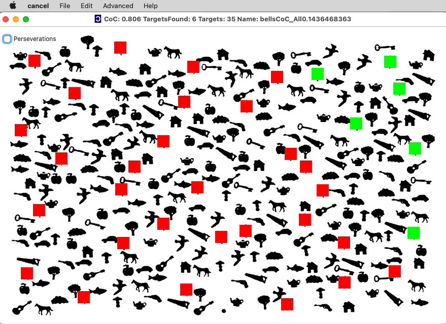

## Center of Cancellation

Cancellation tasks are popular tools for diagnosing spatial neglect. Classically, an individual is shown a piece of paper with a clutter of items, and asked to mark each occurrence of a target item. Individuals with spatial neglect often miss items on the contralesional side of the page. For example, when asked to find all occurrences of the letter ‘A’, an individual who has suffered right hemisphere injury may tend to miss items on the left side of the test. This tool was popularized by Albert (1973), though he noted previous similar tasks.

Cancellation tasks are easy to administer, and spatially biased performance is a strong predictor of other neglect symptoms such as biased spontaneous deviation of the head and eyes and ignoring contralesionally located people or objects (Ferber and Karnath, 2001).

Despite these benefits, there are no sophisticated measures for interpreting these tests. Using simple cutoffs such as omitting 5% or more of the targets will detect both spatially biased and unbiased attentional deficits. However, only patients with spatially biased performance are likely to exhibit the other symptoms of spatial neglect. Therefore, if one wants a sensitive measure for neglect, one needs to account for both the number of errors and the spatial distribution of these errors. Further, classification of patients into either the presence or absence of neglect does not seem like a good approach, as this disorder is actually a continuum, with some individuals showing mild deficits while others show more severe deficits.

We suggest that calculating the center of mass for the detected items is a simple way to interpret the popular cancellation task. One simply sums the horizontal position for each detected item divides this by the number of targets detected. This mean position is sensitive to the spatial bias, and is able to distinguish between mild and severe forms of bias. To make this measure easy to interpret, we suggest that this bias is normalized: the mean horizontal position is translated so that the mean for all items is zero (baseline correction) and the scale of the horizontal axis is adjusted so the range between the leftmost and rightmost target is 2. We refer to this index as the “Center of Cancellation” (CoC). Using this measure, individuals who identify all targets will score zero, individuals who only identify the left most item will receive a score near -1 and individuals who only identify the rightmost items will receive a score near +1. This intuitive scale is easy to remember, being analogous to scales for correlation values.

We believe that measuring the center of cancellation was first implemented by Binder and colleagues (1992). That manuscript was seminal in understanding how anatomy dissociates between line-bisection and cancellation deficits. However, their measure for cancellation performance has faded into obscurity (perhaps because they treated it as a binary classifier, their focus on anatomy, or the fact that they did not provide software to easily implement their measure). We hope that our software and validation (Rorden and Karnath, 2010) inspire a revival of this elegant measure.

##### Free software for calculating the cancellation score

The first step is to download and unzip our software

 - [A pre-compiled version is also available](https://github.com/neurolabusc/Cancel/releases)
 - The source code is available which can be used to compile the software for macOS, Windows and Linux from [https://github.com/neurolabusc/Cancel](https://github.com/neurolabusc/Cancel)

This software comes with two cancellation tests: the Bell’s test (Gauthier et al., 1989) and the Letter task (Weintraub and Mesulam, 1985). In the Bell’s task the goal is to detect all 50 bells scattered among distracting items. In the letter task the goal is to detect all 60 occurrences of the letter ‘A’ hidden among other letters. To administer the tests, print the included JPEG image and ask the participant to mark as many items as possible with a pen. To score the test, launch our software and choose File/Open and select the test you wish to analyze (e.g. the file letter_test.ini). If the person detected most of the items, choose Edit/CheckAll – all the targets turn green, now click on the items the individual missed (making them appear DARK). If the person missed the majority of the targets, choose Edit/UncheckAll – all the targets appear BRIGHT, now click the items the person detected making them turn DARK. As you select and unselect items you will see the center of cancellation score displayed on the program’s titlebar. Once you have completed scoring a patient, choose File/Save to save your dataset.

Once you have scored and saved datasets for several individuals, you can analyze your data. Simply choose File/Statistics and choose all of the patient’s files (you can select multiple files simultaneously). The files will be analyzed and the data will be saved to your clipboard. You can now paste the values into a spreadsheet such as Excel or OpenOffice Calc. If you only need the data from a single individual, use File/Open to display their file and then choose Edit/CopyStatisticsToClipBoard

#####  The Ota Task for measuring allocentric biases

Ota et al. (2001) describe a simple task that attempts to dissociate egocentric neglect (where information on the contralesional side of the viewer’s body is ignored) from allocentric neglect (where the left side of objects is neglected). While this may not be the purest measure of allocentric neglect (see Pouget et al., 1999), it is easy to administer and some have suggested that this test shows dissociations between different patients (as reviewed by Marsh and Hillis, 2008). We have described a continuous measure ‘a’ to describe the severity of allocentric biases shown on this task (Rorden et al., 2012).
The recent versions (June 2013 and later) of our Cancel software allow you to compute ‘a’ for the Ota circle and triangle tasks. In this test the patient sees a paper with a series of triangles (in one version) or circles (in another version) – one third are symmetrical, one third have a defect on the left, and one third have a defect on the right. There are two methods for administering this test, Ota and colleagues (2001) suggest having the individual circle symmetrical items and cross out defective items. Alternatively, we (Rorden et al., 2012) administer this test twice – once requesting patients to mark the (whole) symmetrical items and once asking them to mark the (broken) defective items. We do this because it is simpler to describe and avoids some perseveration errors. However, both methods can be analyzed with our software.

The image on the right shows the performance of one patient on the circles task, with the top left showing the performance marking the whole items, and the bottom left showing performance marking the defective items. To score this with our software, use File/Open and select OtaCircle task. Next, make sure “Mark Defective Task” is UNCHECKED, and select all the items that the participant identified as symmetrical (upper right). Next, CHECK the “Mark Defective Task” item and select all the items that the participant identified as defective. Note that the squares over the targets appear larger than the squares for the non-targets, and that the left and right defective items appear darker and brighter than the symmetrical items. Once you are done, the ‘a’ score appears in the titlebar. Make sure to use File/Save to create an electronic copy of the participants’ performance for future analyses.

#####  Creating new tests

Our software comes with two cancellation tasks: the Bell’s test and the Letter task. However, you can create new cancellation tests easily. Simply place a JPEG image of your test into the same folder as the cancel.exe program and start the program.

 - Select File/NewTest
 - Choose the JPEG image for your test.
 - Report the number of targets in your test. For example the letter test has 60 occurrences of the letter A.
 - You will now see your test with the targets positioned in an evenly distributed grid. You will need to reposition the targets to their actual location on the picture.
 - Move to the location of a target on your JPEG image and control+click this location (make sure you depressed the ‘Control’ key). The nearest target will jump to the location you selected.
 - Repeat the previous step for each target in your JPEG image. Note that the software always moves the closest checkbox to the position you click, even if this is a target you have already positioned. Therefore, you may need to ‘walk’ your checkbox to the correct location by control-clicking near the checkbox you want to move and dragging it toward the final position.

##### Citing this work

If you use our tool, we would be grateful if you would consider citing Rorden and Karnath (2010) or Rorden et al. (2012) if you use the ‘a’ measure with the Ota task. The article describes various measures for neglect and attempts to validate the Center of Cancellation in a large group of individuals who suffer from stroke. If your institution does not offer access to Neuropsychologia please send us an email to receive an electronic version.

##### Relevant articles

 - Albert ML [(1973)](https://pubmed.ncbi.nlm.nih.gov/4736313) A simple test of visual neglect. Neurology. 23:658-64.
 - Binder J, Marshall R, Lazar R, Benjamin J, Mohr JP [(1992)](https://pubmed.ncbi.nlm.nih.gov/1444886) Distinct syndromes of hemineglect. Arch Neurol. 49:1187-94.
 - Ferber S, Karnath H-O [(2001a)](https://pubmed.ncbi.nlm.nih.gov/11778637) How to assess spatial neglect-line bisection or cancellation tasks?. J Clin Exp Neuropsychol. 23:599-607.
 - Gauthier L, Dehaut F, Joanette Y (1989). The bells test: A quantitative and qualitative test for visual neglect. International Journal of Clinical Neuropsychology, 11, 49-54.
 - Marsh EB, Hillis AE. [(2008)](https://pubmed.ncbi.nlm.nih.gov/18761135) Dissociation between egocentric and allocentric visuospatial and tactile neglect in acute stroke. Cortex. 44(9):1215-20.
 - Ota H, Fujii T, Suzuki K, Fukatsu R, Yamadori A. [(2001)](https://pubmed.ncbi.nlm.nih.gov/11739827) Dissociation of body-centered and stimulus-centered representations in unilateral neglect. Neurology. 57(11):2064-9.
 - Pouget, A., Deneve, S. Sejnowski, T.J. (1999) Frames of reference in hemineglect: a computational approach. Progress in Brain Research 121:81-97. Jim Reggia, Eytan Ruppin and Dennis Glanzman (eds). “Neural modeling of brain disorders”. Elsevier.
 - Rorden C, Karnath HO. [(2010)](https://pubmed.ncbi.nlm.nih.gov/20433859) A simple measure of neglect severity. Neuropsychologia. 48(9):2758-63.
 - Rorden C, Hjaltason H, Fillmore P, Fridriksson J, Kjartansson O, Magnusdottir S, Karnath HO. [(2012)](https://pubmed.ncbi.nlm.nih.gov/22608082) Allocentric neglect strongly associated with egocentric neglect. Neuropsychologia. 50(6):1151-7.
 - Weintraub S, Mesulam, MM (1985). Mental state assessment of young and elderly adults in behavioral neurology. In M.M. Mesulam (Ed.), Principles of behavioral neurology (pp. 71-123). Philadelphia: Davis Company.
